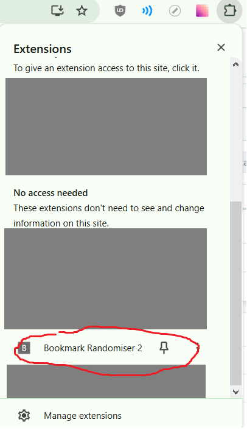
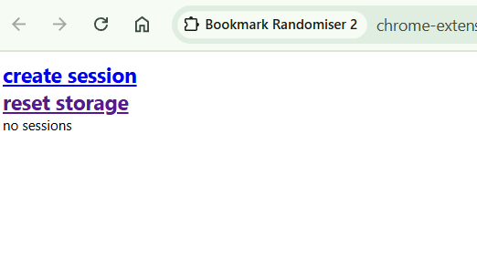
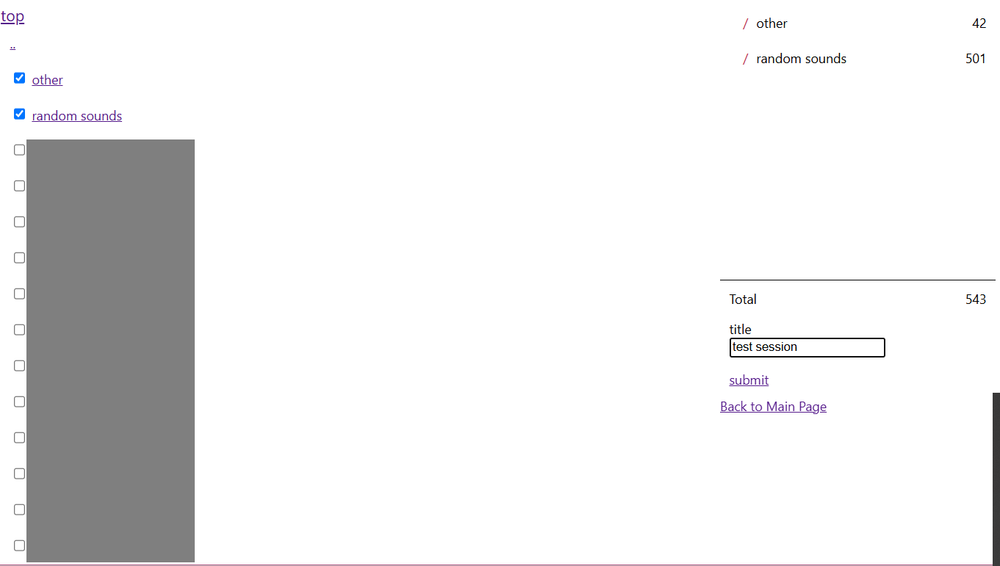
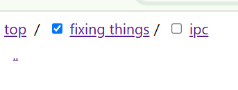
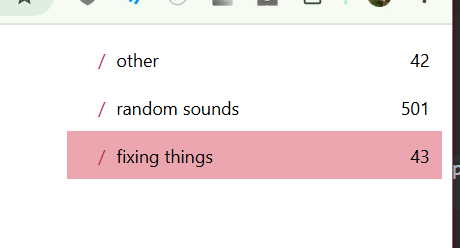
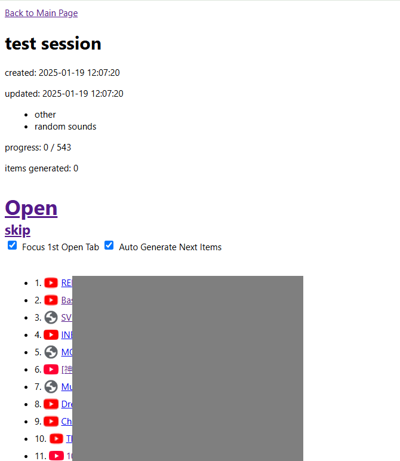
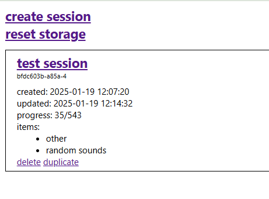

# Bookmark Randomiser v2
Chrome extension tool to randomly open random bookmarks from selected folders, with randomisation session management.

This tool is in beta - proper visual UI is still planned for development.

# Features
- Select bookmark folders to create sessions
    - Can select multiple folders per session
- Sessions present bookmarks to you in random order without repetition, allowing you to iterate through all bookmarks in your selected folders
- Can choose to open all presented bookmarks or manually select just a few to open
- Can leave session and return later
- Able to name sessions to remember their purpose
- Duplicating session will reset and re-randomise progress, allowing you to reuse a set of folders selected for a session without having to re-create the session

# Installation
1. On release page, download a release
2. Unzip somewhere
3. In chrome extensions page, "Load Unpacked"
4. Select the folder

# Usage Example
Click extension icon to open Randomiser Page

Click "create session"

Select the folders you would like to randomise through. Can click on folders to navigate.

- In the right panel, can click folders to remove them, or uncheck them in the left panel
- Can also uncheck them in the navigate toast path

Give a title and press submit to create session.

If don't give title, will automatically create title based on your selected folders.

Creating session will go to the Randomiser Page.

This will present to you a random amount of bookmarks.

- Click "Open" to open all the presented bookmarks, and focus the first one. Then you can go through all the opened bookmarks
    - When returning to the Randomiser Page, it will have already generated the next set of bookmarks
- Click "skip" to go to the next set of bookmarks without opening anything
- Click each bookmark link to individualy open in new tab
- All progress to session will be saved upon skipping or opening all. Progress counter shows how many bookmarks in this session have been consumed
- "Items generated" counter shows how much you have generated in this current Randomiser Page
- With "Auto Generate" off, clicking "Open" will not generate the next set. The button will instead be replaced with "Generate"
    - This way you can open the items you just opened again, if you seem to be needing to do that

If Randomiser Page is closed, you can get back to the session by re-opening the Randomiser Main Page by clicking the extension icon.

The page will show all sessions that have been made.

